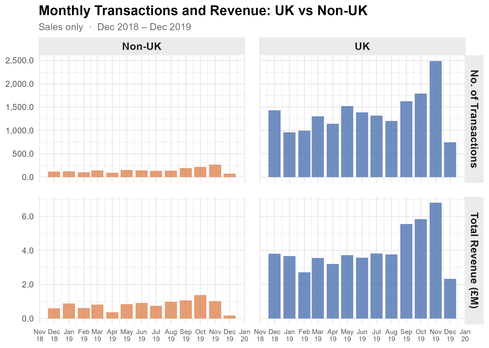
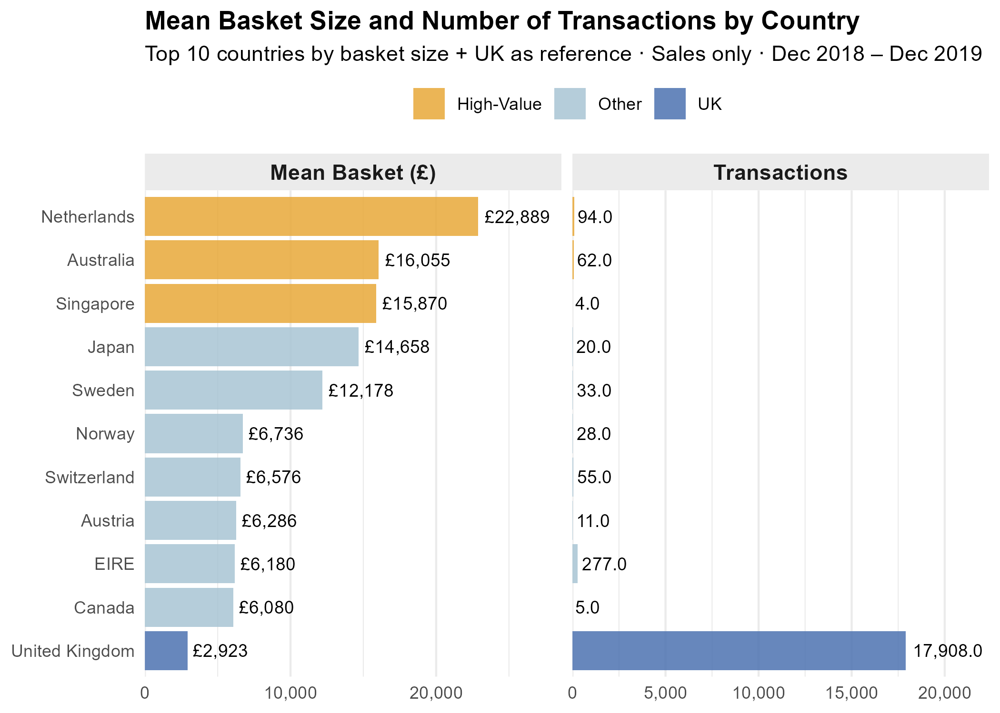
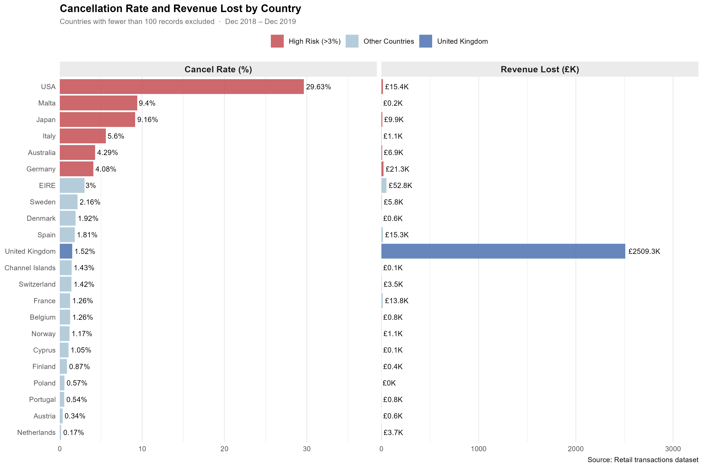

```{r setup}
library(knitr)
```

# Problem Introduction {.center-slide}

## Research Questions

-   How do transaction volume and revenue differ between UK and international markets?
-   Are there international markets with strong growth potential?
-   What operational challenges may limit international expansion?

## Why It Matters

-   Supports strategic growth decisions
-   Identifies high-value customer segments
-   Highlights operational risks affecting profitability

## Dataset Overview

::: {style = 'font-size: 0.9em;'}

| Attribute | Description |
|------------------------------------|------------------------------------|
| Source | Kaggle Retail Transactions Dataset |
| Period | Dec 2018 – Dec 2019 |
| Raw Dataset | 536,350 observations, 8 variables |
| Final Dataset | 531,150 observations, 13 variables |
| Key Variables | Transaction No., Product, Quantity, Price, Country, Date, Revenue |
:::

# Methodology {.center-slide}

## Steps Taken

| Stage | Actions |
|--------------------|----------------------------------------------------|
| Data Cleaning | Standardised variable names and removed duplicate records |
| Feature Engineering | Created revenue, date components and transaction type variables |
| Market Segmentation | Categorised transactions into UK and Non-UK markets |
| Analysis | Examined revenue, transaction volume, basket value and cancellations |

# Results {.center-slide}

## UK vs International Performance

::::: {.columns style="display: flex !important; height: 90%;"}
::: {.column width="40%" style="font-size: 0.8em; display: flex; justify-content: center; align-items: center;"}
-   UK generated most transactions and revenue.
-   Strong growth from September onwards.
-   Peak performance in November 2019.
-   International markets followed similar seasonal trends.
:::

::: {.column width="60%" style="display: flex; justify-content: center; align-items: center;"}
```{r}

```
:::
:::::

## Seasonal Trends

-   Highest revenue in October–November.
-   Holiday season drives performance.
-   December 2019 likely incomplete in dataset.
-   Business is highly seasonal.

## High-Value International Markets

::::: {.columns style="display: flex !important; height: 90%;"}
::: {.column width="40%" style="font-size: 0.8em; display: flex; justify-content: center; align-items: center;"}
-   Some countries generated exceptionally high basket values despite relatively low transaction volumes.
-   This purchasing pattern is consistent with wholesale or business-to-business (B2B) customers.
-   These markets represent potential opportunities for future international growth.
:::

::: {.column width="60%" style="display: flex; justify-content: center; align-items: center;"}
```{r}

```
:::
:::::

## Cancellation Analysis

::: {.center style = 'width: 80%'}

```{r}

```

:::

## Key Findings 

::: {style = 'font-size: 0.8em;'}

-   The United States recorded the highest cancellation rate at approximately 29.6%.

-   Malta and Japan also exhibited elevated cancellation rates of approximately 9.4% and 9.2% respectively.

-   In comparison, the United Kingdom maintained a relatively low cancellation rate of around 1.5%.

-   Cancellation rates are substantially higher in several international markets than in the UK.

-   This suggests potential challenges in international order fulfilment, logistics, or customer demand management.

-   Further investigation into the causes of cancellations is recommended before expanding operations in these markets.

:::

# Conclusions & Recommendations {.center-slide}

## Conclusions

-   The UK remains this retailers dominant market.
-   International markets provide growth opportunities.
-   Some countries show strong B2B potential.
-   Operational issues must be addressed before expansion.

## Recommendations

-   Reduce seasonal dependency.
-   Develop dedicated B2B program.
-   Improve international fulfilment processes.

# Thanks! {.center-slide}